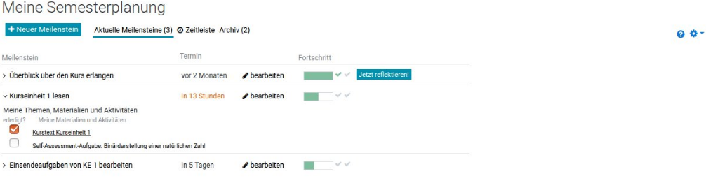
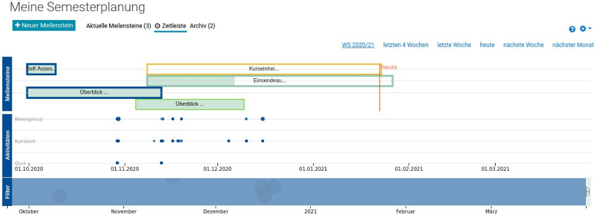
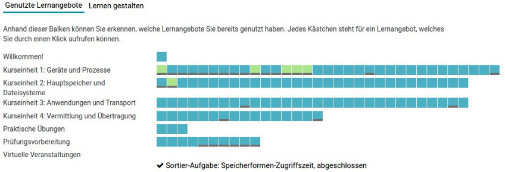
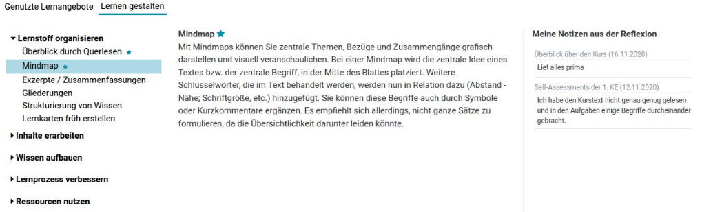

<br>
<div align="center">

</div>

<br>
<h1 align="center">Serial1</h1>

## *Serial1* is a Moodle course format plugin supporting self-regulated learning in terms of planning milestones, monitoring learning activities, and reflecting past learning activities.


*Serial1* (format_serial1) is a *Learning Analytics Dashboard* for Moodle courses. The dashboard presents moodle activities on a timeline and enables the user to define milestones. Each milestone is associated with learning objectes, a deadline, certain course ressources and learning strategies to be applied.


<!-- development-related badges -->
[](https://github.com/CATALPAresearch/format_serial1/commit-activity)
[](https://github.com/CATALPAresearch/format_serial1/commit/)
[](https://github.com/CATALPAresearch/format_serial1/contributors/)
[](https://github.com/CATALPAresearch/format_serial1/issues/)
[](http://perso.crans.org/besson/LICENSE.html)


<!-- Maturity-related badges 
see: https://github.com/mkenney/software-guides/blob/master/STABILITY-BADGES.md
-->
[](https://github.com/mkenney/software-guides/blob/master/STABILITY-BADGES.md#deprecated)
[](https://github.com/mkenney/software-guides/blob/master/STABILITY-BADGES.md#experimental)


<!-- AI-related and LA-related badges -->
<!-- 
https://nutrition-facts.ai/

Privacy Ladder Level
Feature is Optional
Model type
Base model
Base Model Trained with Customer Data
Customer Data is Shared with Model Vendor
Training Data Anonymized
Data Deletion
Human in the Loop
Data Retention
Compliance
-->


<br><br>
<p align="center" >
   <br><br>
   <br><br>
   <br><br>
</p>

<p align="center">
  <a href="#key-features">Key Features</a> •
  <a href="#how-to-use">How To Use</a> •
  <a href="#download">Download</a> •
  <a href="#credits">Credits</a> •
  <a href="#related">Related</a> •
  <a href="#citation">Citation</a> •
  <a href="#license">License</a>
</p>


## Key Features

**Supporting self-regulated learning**
- planning phase: enable the user to define milestones by defining a learning objective, necessary ressources, and appropriate learning strategies
- performance phase: provide monitoring instruments as a learning analytics dashboard
- reflection phase: trigger reflections by pre-defined short questionnaire
- it provides information about effective learning strategies

**Learning Analytics Dashboard**
- visualize Moodle activities and the planned milestones on a timeline
- represent progress per course unit in a simple progress bar visualisation considering the individual milestone planning

**Learning Analytics included**
* collection of clickstream data including mouse over events 


## Roadmap and Limitations
This plugin is not maintained anymore. Instead its successor [SERIAL3](https://github.com/CATALPAresearch/format_serial3) is under active maintance.

## How To Use

To clone and run this application, you'll need [Git](https://git-scm.com) and [Node.js](https://nodejs.org/en/download/) (which comes with [npm](http://npmjs.com)) installed on your computer. From your command line:

```bash
# Clone this repository
1. Clone  the repository to /your-moodle/course/format/
$ git clone git@github.com:catalparesearch/format_serial1.git

# Rename the folder to 'serial1'
$ mv format_serial1 serial1

# Go into the repository
$ cd serial1

# Install dependencies
$ npm -i

# Build code using grunt
$ grunt plugin-build # transpiles all js code
$ grunt plugin-check # run js linter
$ grunt plugin-css # bundles and minifies css files
$ grunt plugin-all # handles both tasks mentioned above

# Open the page https://<moodle>/admin/index.php?cache=1 and follow the install instructions for the plugin or
$ php admin/cli/uninstall_plugins.php --plugins=format_serial1 --run

# Now, login to your Moodle as an administrator. The install/update GUI should open automatically. Just follow the steps the GUI presents to you and you should have installed the *Serial1* plugin successfully afterwards. As an alternative to using the GUI for installation, you can also run the update script from within the folder of your Moodle installation:
$ php admin/cli/upgrade.php

# Open a course of you choice and go to the *course settings* (watch out for the littel cog-icon). In the section 'course format' select 'serial1'. After saving your course will be presented with Serial1

```

## Download

You can [download](https://github.com/catalparesearch/format_serial1/releases/tag/latest) the latest installable version of *Serial1* for Moodle 3.11.

## Getting into Development

* api.php: In this file you'll find the SQL queries. All API get or post requests implement  webservices. The naming conventions are very strict. Take care to to follow the nameing schema for the functions. 
* db/services.php: Here your are defining the webservice by referencing the involved files (api.php and its containing classes and functions)
* version.php: Every time you are changing the webservice description in service.php you need to increment the version by 1 and update the plugin in moodle (See the *notifications* page in the administration panel)
* amd/scr: This is the folder where all custome javascript is located.
* lib: This the folder where all third party javascript is stored.
* /amd/serial1.js: This is the only script that is called by the HTML-DOM of the plugin. By using require.js all other files and dependencies are loaded on demand in this file and passed to the components (like the Timeline or the Assessment) underneath.
* amd/src/Assessment.js: This the major file where your assment dashboard has to be written. All necessray dependencies (d3, dc, vue) should be available there. The data from the server should be provided in the function call inside /amd/serial1.js, just below the Timeline call.


## Emailware

*Serial1* is an [emailware](https://en.wiktionary.org/wiki/emailware). Meaning, if you liked using this plugin or it has helped you in any way, I'd like you send me an email at <niels.seidel@fernuni-hagen.de> about anything you'd want to say about this software. I'd really appreciate it!

## Credits

This software uses the following open source packages:
[vue.js](https://vuejs.org/), 
d3.js, 
crossfilter, 
dc.js, 
moment.js

## Related

tba.

## Citation

> Seidel, N., Burchart, M., & Karolij, H. (2024). SERIAL1 - Moodle activity plugin supporting learner in reading longer texts. https://doi.org/10.17605/OSF.IO/VFSMD

```
@misc{Seidel2024-MoodleSerial1,
author = {Seidel, Niels and Burchart, Mark and Karolij, Heike},
doi = {10.17605/OSF.IO/VFSMD},
keywords = {P-APLE-II,software},
title = {{SERIAL1 - Moodle activity plugin supporting learner in reading longer texts}},
url = {https://github.com/CATALPAresearch/format{\_}serial1},
year = {2024}
}
```

**Research articles and datasets about Serial1:**

* Seidel, N., Karolyi, H., Burchart, M., & de Witt, C. (2021). Approaching Adaptive Support for Self-regulated Learning. In D. Guralnick, M. E. Auer, & A. Poce (Eds.), Innovations in Learning and Technology for the Workplace and Higher Education. TLIC 2021. Lecture Notes in Networks and Systems (pp. 409–424). Springer International Publishing. https://doi.org/10.1007/978-3-030-90677-1_39


## You may also like ...

* [format_serial3](https//github.com/catalparesearch/format_serial3) - Learning Analytics Dashboard for Moodle Courses
* [local_ari](https//github.com/catalparesearch/local_ari) - Adaptation Rule Interface


## License

[GNU GPL v3 or later](http://www.gnu.org/copyleft/gpl.html)


## Contributors
* Niels Seidel [@nise81](https://twitter.com/nise81)
* Marc Burchart
* Heike Karolyi

---
<a href="https://www.fernuni-hagen.de/english/research/clusters/catalpa/"></a>
<a href="https://www.fernuni-hagen.de/"></a>


<!--
**Limesurvey bindings**

* Manuell in der Tabelle limesurvey_assigns die Kurs-ID sowie die ID der
   LimeSurvey-Umfrage (z.B. https://umfrage.fernuni-hagen.de/v3/827287
   => *827287*) einpflegen, um eine verpflichtende Umfrage vor der Kursnutzung zu realisieren. 
   Was gibt man bei start and stop date an? 1597673805 (https://www.unixtimestamp.com/)
* Damit Moodle den Abschluss einer Umfrage registrieren kann, muss in Limesurvey eine End-URL definiert werden. Unter XXX muss eine URL gemäß des folgenden Schemas eingefügt werden:
   * `[moodlePfad]/course/format/serial1/survey.php?s={SID}&a={SAVEDID}`
   * z.B. `http://aple.fernuni-hagen.de/course/format/serial1/survey.php?s={SID}&a={SAVEDID}`

* Die Umfrage muss aktiv sein und nach einem Test müssen die
   Cookies zurückgesetzt werden (sonst klappt es bei LimeSurvey mit den
   Parametern nicht).
-->